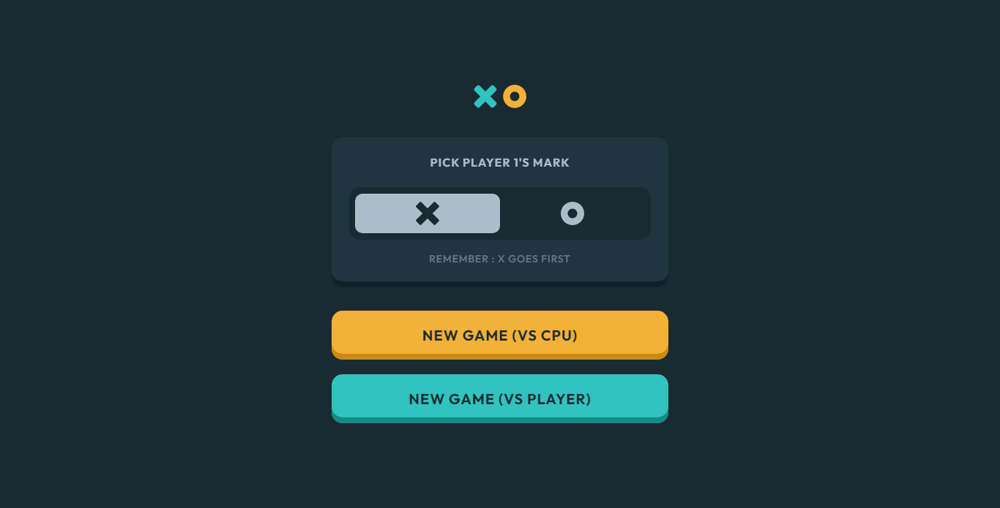

# Frontend Mentor - Tic Tac Toe solution

This is a solution to the [Tic Tac Toe challenge on Frontend Mentor](https://www.frontendmentor.io/challenges/tic-tac-toe-game-Re7ZF_E2v). Frontend Mentor challenges help you improve your coding skills by building realistic projects. 


## Table of contents

- [Overview](#overview)
  - [The challenge](#the-challenge)
  - [Screenshot](#screenshot)
  - [Links](#links)
- [My process](#my-process)
  - [Built with](#built-with)
  - [What I learned](#what-i-learned)
  - [Continued development](#continued-development)
- [Installing the app](#running-the-app)
- [Author](#author)

## Overview

This challenge is adopted from the classic tic tac toe game that we all played before. This particular challenge gives you a design plus some mode for you to play. It includes playing a cpu or you can play it with locally with 2 players.

### The challenge

Users should be able to:

- View the optimal layout for the game depending on their device's screen size
- See hover states for all interactive elements on the page
- Play the game either solo vs the computer or multiplayer against another person
- **Bonus 1**: Save the game state in the browser so that it’s preserved if the player refreshes their browser
- **Bonus 2**: Instead of having the computer randomly make their moves, try making it clever so it’s proactive in blocking your moves and trying to win

### Screenshot



### Links

Live Site URL: [Live site of the challenge](https://frontendmentor-tictactoe.vercel.app/)

## My process

Hi, thanks again for checking out this project of mine!

This is my 25th project taken from [frontendmentor](https://www.frontendmentor.io/) and my first premium challenge that is focused more towards javascript as it requires you to implement some algorithm ( if you want ) so that your game will be unbeatable even if we hate to lose. But hey, you can win against your friends or near ones playing the local mode.

For this one, I used next.js as my framework of choice. Initially, I treated the app as a SPA with no url changes and when i'm almost done, I thought that it is not the best approach and that's why I created the pages for each cpu and local so players can just directly go to it.

For the tic-tac-toe tiles, I initially made use of `buttons` inside the gridcells, but I changed it into just a single `div` with `role="gridcell`. The reason for this is that, when a user traverse a `button` of course there is a expected two way state, the toggled or untoggled, I don't want the user to think that they can **undo** a tic-tac-toe move since it is a `button` and making use of `disabled` or even adding `sr` text inside it will just be confusing, also it makes screen-reader announce two times the text inside it. So in the end, it is implemented using `div` with `role="gridcell` and `tabindex` so that they will be focusable and it is much intuitive than `button` on this one.

Also, this is my first project that I implemented testing!! This is really huge for me because when I started doing web development, testing is one of my learning goal but haven't done it until now. For this, I used a test first approach where you write the test before doing the code itself for the program or function. The whole backtrack algorithm is implemented using a test first approach and for the logic of that algorithm, this [blog helped me understanding it a bit](https://www.neverstopbuilding.com/blog/minimax).

For the components, when building it out first, I didn't follow the test fir approach because I don't know how to properly execute it on components, many questions like, " should I test every component? " and that really down me a bit for testing. But hey, for some features like the new user experience (NUX) and the arrow navigation on the grids, those were implemented test first!! Lots of googling was made in there and I almost give up doing testing because I don't have an idea on how to test the module that I use for creating the whole state of the app.

I may have finished this app a bit sooner but those test gave me headaches. But still, when I see those green lights in my test, honestly, that felt really good ^_^.

### Built with

- Semantic HTML5 markup
- Next.js
- React
- Styled Components
- Framer-motion
- Typescript
- react-tracked

### What I learned

#### Jest

Jest is a javascript testing framework where it aims to ensure correctness on your code by testing it and you don't even need to manual test each component or bits of code in your program. Before testing, make sure that you have a file that contains either `.spec` or `.test` like `header.spec.tsx`, this way jest will know what files are test files. You can either use an approach where you create a `__test__` folder on the root of the project or just add the test files besides the original file, I used the latter part. So, the test looks like this:

```
describe("tic-tac-toe-logic", () =>{
  test("cpu should give an optimal index move, O mark", () =>{
    const input = [
      "", "", "X",
      "", "", "",
      "", "", ""
    ]
    const optimalMoveIndex = testFunctionThatGivesOptimalMove(input, "O");

    expect(optimalMoveIndex).toEqual(4);
  })
})
```

When doing test, you can use `describe` to hold multiple `test` blocks, this way they are grouped or you can just directly add multiple `test` blocks. 

Each `test` function needs to have the first argument, a name that describeds what the test will do, the second argument must be a function and inside that function, you will create the tests.

On my case, the `testFunctionThatGivesOptimalMove` is a function that gives the optimal move, and as you can see on the `input` variable, the optimal next move index for that should be in the middle of the 3x3 which is index `4`.

On the last part, I am expecting the the `optimalMoveIndex` variable will contain 4 have i am expecting it `toEqual` 4. If this matches then you will see a green link either your terminal where you ran the test or in your code editor. Green means passes and red means not. There are lots of `matchers` where you can look at in the [jest website](https://jestjs.io/).


#### React Testing Libary

React testing libary is a testing library that uses jest under the hood, the main goal of this library is involve querying nodes similarly on how a user interacts with your components on your site.

Them same approach is used on this like jest, where you add `.spec` or `.test` files. Same concept but with added more utilities for getting nodes. A sample test code would be something like this:

```
import { screen } from "@testing-library/react";

test("Heading 1 should appear in the page and login button should not appear", () =>{
  expect(screen.getByRole("heading")).toHaveTextContent("Frontendmentor is the best");

  expect(screen.queryByRole("button", {name: "login"})).not.toBeInTheDocument();
})
```

As you may noticed, when getting elements to test, we are getting the element based on what they will appear in the dom, where the users can see.

On the first one, we are expecting a single heading tag to appear in the dom and expecting it to have the text `Frontendmentor is the best`. 

For the second by, notice how I used `.queryByRole` instead of `.getByRole`. When you read the doc of react testing libary, the `.getByRole` will throw an error if the element is not present while `queryByRole` won't throw an error but instead returns a `null` object. Also from the [github repo for queries in RTL](https://github.com/testing-library/eslint-plugin-testing-library/blob/main/docs/rules/prefer-presence-queries.md)
You should use `.getBy` for checking an element inside the dom and when you are checking if the element is not present, then use `.queryBy`.

### Continued development

Finishing this project by the project's goal is done, but for me, I plan to add an online mode where users can play with other people, so for that update, I will be using `socket` and i'm really excited on that part, it's been a while since I used `socket` and this will really help me in terms of doing testing as I will do it using a test first approach.

If you are having trouble doing testing, we are on the same page, I almost want to abandon my tests file! But in the end, I think more and got a moment of " okay, I see"` and on that moment, I got my answer solved because I managed to think more because of testing. Remember when doing test, it doesn't only test our code, it also test us...Literally.

Thank you!!

## Running the app

This is the updated version of the previous challenge. Now, there is an implementation of online mode where it uses a socket, therefore I created a separate express server for it.

You can view this [repository for more information](https://github.com/pikapikamart/server-tic-tac-toe).

Thank you!

## Author

- Website - Well I haven't made my profile portfolio, gonna make it sooon when I know a lot of things.
- Frontend Mentor - [@pikamart](https://www.frontendmentor.io/profile/pikamart)
- Twitter - [@RaymartPamplona](https://twitter.com/RaymartPamplona)
